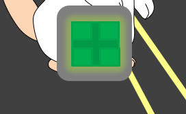

# Mouse Swift


Ce jeu est le seul d'une multitude de jeux que j'ai faits quand j'avais 12-13 ans !

## Auteur

* [Pedro Luis Bernardos](https://www.linkedin.com/in/pedro-luis-bernardos/)

## :wrench: Installation

Cloner ce dépôt et accéder au dossier du jeu:

```bash
$ git clone https://github.com/PedroLuisBernardos/PowerPoint-Game
$ cd PowerPoint-Game
```

## 🐭 Comment jouer ?

Ouvre le fichier `Mouse Swift.ppsx` pour jouer

Le jeu est en espagnol donc je vais détailler les principaux principes ici:

* Vous devez toujours vous placer vis-à-vis le carré vert que vous allez voir au début. **Tous les mondes commencent là.**


* Vous devez ensuite prendre les blocs de fromage 🧀 pour déverrouiller le carré rouge pour passer au prochain niveau. **Ne pas oublier de se placer vis-à-vis le carré vert du début pour commencer au bon endroit pour le deuxième niveau**.
* Si vous sortez des plateformes grises -> `vous perdez`


